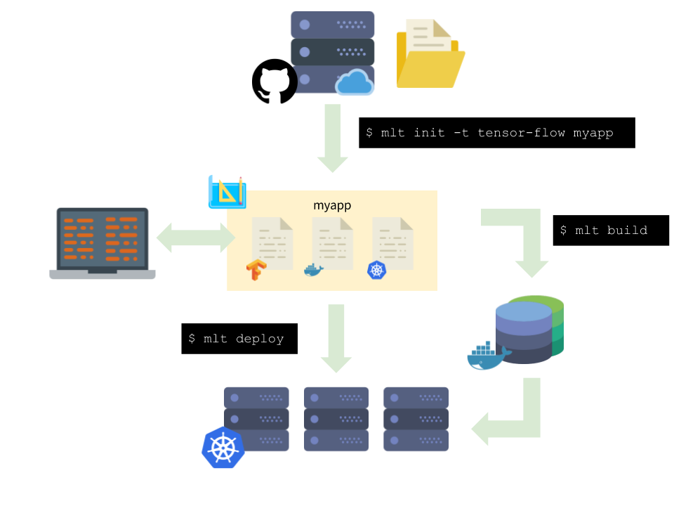
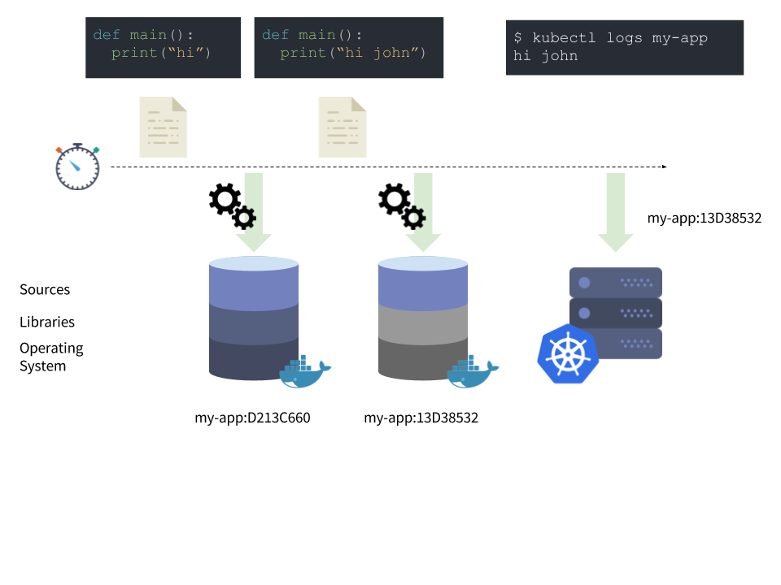

# mlt
Machine Learning Container Tool

[](https://circleci.com/gh/IntelAI/mlt)

`mlt` aids in the creation of containers for machine learning jobs.
It does so by making it easy to use container and kubernetes object templates.



We have found it useful to share project templates for various machine learning frameworks. Some have native support from Kubernetes operators, such as mxnet and TensorFlow. Others do not, but still have best practices for how to run on a Kubernetes cluster.

On top of getting boiler plate code at the beginning of a project to work, the best practices may change over time. `mlt` allows existing projects to adapt to these without having to reset and start over.



`mlt` addresses another aspect of the application development: _iterative_ container creation. Storage and container creation is supposed to be fast - so why not rebuild containers automatically?
`mlt` has a `--watch` option, which lets you write code and have an IDE-like experience.
When changes are detected, a timer starts and triggers container rebuilds.
lint and unit tests can be run in this step, as an early indicator of whether the code will run in the cluster.
When the container is built, it is pushed to the cluster container registry.
From here, it is a quick step to redeploy the Kubernetes objects, through `mlt deploy`


## Build

Prerequisites:
- git
- python
- tox
- virtualenv
- TFJob operator (for the distributed tensorflow templates)

Installation:

```bash
$ make
# Two different options to running `mlt`:
$ source ./.venv/bin/activate
# add this to ~/.bash_profile, ~/.bashrc, etc and then source it for python2 and python3
alias mlt='{path_to_mlt_repo}/.venv/bin/mlt'
alias mlt3='{path_to_mlt_repo}/.venv3/bin/mlt'
```

## Usage summary

### Sample mlt deployment
[](https://asciinema.org/a/171353)

```bash
# cd outside of the mlt tree
$ cd ..
$ mlt templates list
Template        Description
--------------  ----------------------------------------------------------------------------------------------
hello-world     A TensorFlow python HelloWorld example run through Kubernetes Jobs.
tf-distributed  A distributed TensorFlow matrix multiplication run through the TensorFlow Kubernetes Operator.
tf-single-node

$ mlt init my-app --template=hello-world
[master (root-commit) 40239a2] Initial commit.
 7 files changed, 191 insertions(+)
 create mode 100644 mlt.json
 create mode 100644 Dockerfile
 create mode 100644 Makefile
 create mode 100644 k8s-templates/tfjob.yaml
 create mode 100644 k8s/README.md
 create mode 100644 main.py
 create mode 100644 requirements.txt

$ cd my-app
$ mlt build
Starting build my-app:71fb176d-28a9-46c2-ab51-fe3d4a88b02c
Building |######################################################| (ETA:  0:00:00)
Pushing  |######################################################| (ETA:  0:00:00)
Built and pushed to gcr.io/my-project-12345/my-app:71fb176d-28a9-46c2-ab51-fe3d4a88b02c

$ mlt deploy
Deploying gcr.io/my-project-12345/my-app:71fb176d-28a9-46c2-ab51-fe3d4a88b02c

Inspect created objects by running:
  $ kubectl get --namespace=my-app all

### To deploy in interactive mode (using no-push as an example)
### NOTE: only basic functionality is supported at this time. Only one container and one pod in a deployment for now.
#### If more than one container in a deployment, we'll pick the first one we find and deploy that.

$ mlt deploy -i --no-push
Skipping image push
Deploying localhost:5000/test:d6c9c06b-2b64-4038-a6a9-434bf90d6acc

Inspect created objects by running:
$ kubectl get --namespace=robertso all

Connecting to pod...
root@test-9e035719-1d8b-4e0c-adcb-f706429ffeac-wl42v:/src/app# ls
Dockerfile  Makefile  README.md  k8s  k8s-templates  main.py  mlt.json	requirements.txt
```
