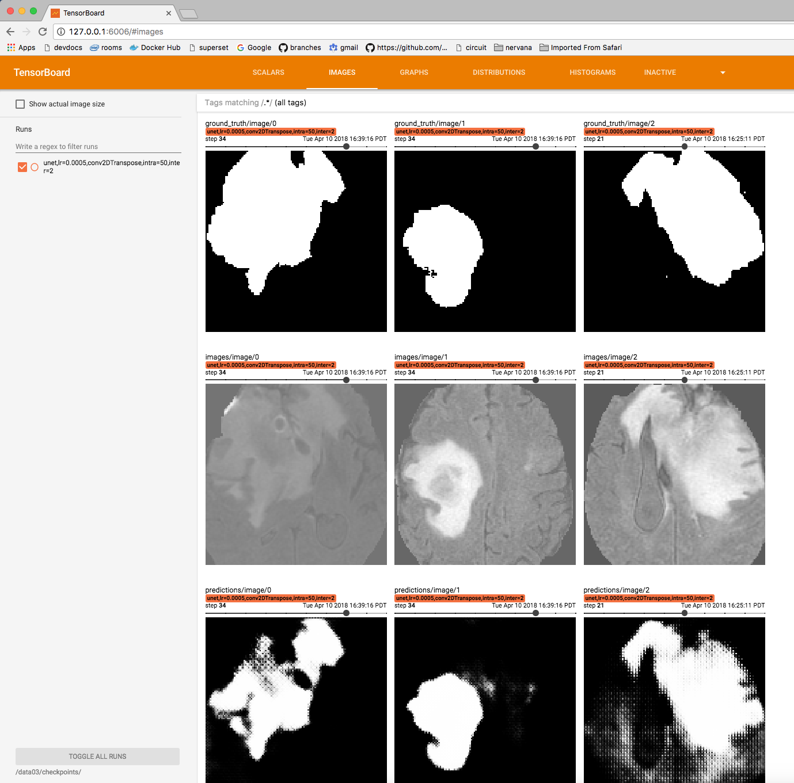

# Distributed U-Net model training using KVC and MLT

This example explains the process of adapting an MLT template to train
a different model.  In this case, we are using the
[distributed U-Net](https://github.com/NervanaSystems/topologies/tree/master/distributed_unet)
TensorFlow model, which locates tumors in brain scan images.  We are
also using the [kube-volume-controller (KVC)](https://github.com/kubeflow/experimental-kvc)
to transfer the data to the nodes prior to running model training.

## Prerequisites

This example requires that you have MLT and it's depedencies installed,
as well as the following CRDs are installed on your Kubernetes cluster:
- [Kube-Volume-Controller](https://github.com/kubeflow/experimental-kvc/blob/master/docs/ops.md#installing-the-controller)
- [TF-Operator](https://github.com/kubeflow/tf-operator)

You will also need to register to obtain the BraTS dataset.
Information on getting the dataset is located [here](https://github.com/NervanaSystems/topologies/tree/master/distributed_unet#required-data).

## Transferring data to the cluster

After we get the BraTS dataset, we can use KVC to transfer the data from
our storage location (S3, GCS, or NFS) to the Kubernetes nodes.  This
allows us to run the model training multiple times without needing to
wait for the data to transfer to the node every time.

The [kvc/kvc_unet_gcs.yaml](kvc/kvc_unet_gcs.yaml]) file conatins
an example of the KVC custom resource spec, which includes information
such as the storage bucket path, the number of replicas, as well as the
credentials required to access storage bucket:

```yaml
apiVersion: kvc.kubeflow.org/v1
kind: VolumeManager
metadata:
  name: unet-data
  namespace: your-namespace
spec:
  volumeConfigs:
    - id: "unet"
      replicas: 6
      sourceType: "S3"
      sourceURL: "s3://your-bucket/unet/"
      accessMode: "ReadWriteOnce"
      endpointURL: "https://storage.googleapis.com"
      capacity: 18Gi
      labels:
        key1: unet
      options:
        awsCredentialsSecretName: gcs-creds
        timeoutForDataDownload: 20m
```

Update this file with your information (such as your `namespace`,
`sourceURL`, etc), then use the following command to create the KVC
Volume Manager for the dataset:

```bash
$ kubectl create -f kvc/kvc_unet_gcs.yaml
volumemanager "unet-data" created
```

Once the data transfer has completed, the `volumemanager` has the
status `message: success`.  We can then get the `nodeAffinity`,
which tells us which nodes have our data and the `hostPath` for the path
to where our data resides on the nodes (we'll need this information
later).

```bash
$ kubectl get volumemanager unet-data -o yaml
apiVersion: kvc.kubeflow.org/v1
kind: VolumeManager
metadata:
  clusterName: ""
  creationTimestamp: 2018-04-17T00:19:24Z
  generation: 0
  name: unet-data
  namespace: your-namespace
  resourceVersion: "4552336"
  selfLink: /apis/kvc.kubeflow.org/v1/namespaces/your-namespace/volumemanagers/unet-data
  uid: fb5841cd-41d4-11e8-90bb-42010a8a01e6
spec:
  state: ""
  volumeConfigs:
  - accessMode: ReadWriteOnce
    capacity: 18Gi
    endpointURL: https://storage.googleapis.com
    id: unet
    labels:
      key1: unet
    options:
      awsCredentialsSecretName: gcs-creds
      dataPath: /var/datasets
      timeoutForDataDownload: 20m
    replicas: 6
    sourceType: S3
    sourceURL: s3://your-bucket/unet/
status:
  message: successfully deployed all sub-resources
  state: Running
  volumes:
  - id: unet
    message: success
    nodeAffinity:
      requiredDuringSchedulingIgnoredDuringExecution:
        nodeSelectorTerms:
        - matchExpressions:
          - key: kubernetes.io/hostname
            operator: In
            values:
            - gke-cluster-default-pool-1
            - gke-cluster-default-pool-2
            - gke-cluster-default-pool-3
            - gke-cluster-n1-highmem-8-skylake-1
            - gke-cluster-n1-highmem-8-skylake-2
            - gke-cluster-n1-highmem-8-skylake-3
    volumeSource:
      hostPath:
        path: /var/datasets/kvc-resource-abc1234-56789
```

## Updating the app to run the U-Net model

In order to create the U-Net app for MLT, we started by initializing
the app using `tf-dist-mnist` template.  We picked this template since
it was most similar to what we needed to do for running the U-Net model.
These are the steps that we took to update the app:
 1. Replaced the MNIST model training file with the U-Net model training
 python files from the
[NervanaSystems/topologies](https://github.com/NervanaSystems/topologies/tree/master/distributed_unet)
repo.
 2. Updated the `Dockerfile` entry point to execute the main U-Net
 training script, which is called `test_dist.py`.
 3. Updated the `k8s-templates/tfjob.yaml` file:
    * Added memory resource limits for the parameter server and workers,
    because we ran into issues with pods getting evicted when we didn't
    set memory limits.
    * Added AWS/GCS credentials environment variables in order to be
    able to access GCS for storing checkpoint files.
    * Added an `OUTPUT_PATH` environment variable with the name of the
    bucket where checkpoint files will get saved.
    * Added the `nodeAffinity`, volume `hostPath`, and `volumeMounts` to
    the worker, so that the model can access the dataset in the
    container at the `/tmp/data` directory.  Note that the
    `nodeAffinity` and `hostPath` came from the KVC `volumemanager` that
    was setup earlier.
 4. Updated the `settings_dist.py` file to get the `OUTPUT_PATH`
 environment variable for storing checkpoint files.
 5. Updated the main `test_dist.py` file to get the `TF_CONFIG`
 environment variable for the cluster information (list of workers,
 parameter server, job name, and task index).

The updated app is located in the [mlt_app](mlt_app) directory.  Before
running the app, you will need to update:

 * `k8s-templates/tfjob.yaml` with:
   * Your storage bucket for the `OUTPUT_PATH`
   * Your secrets/credentials for the AWS environment variables.
   * The `nodeAffinity` and `hostPath` for your volume manager.
 * `mlt.json` with:
   * Your namespace
   * Your `gceProject` or docker `registry`

## Running the MLT app

Once you've made the necesary updates to the app, you can build and
deploy the app:

```bash
$ mlt build
Starting build distributed-unet:f57ff3b2-b77d-4b50-8dce-37dc04acacbf
Building |#########################################################################################################################################################################| (ETA:  00:00:00)
Built distributed-unet:f57ff3b2-b77d-4b50-8dce-37dc04acacbf

$ mlt deploy
Pushing  | (Elapsed Time: 0:00:17)
Pushed to gcr.io/cluster-12345/distributed-unet:f57ff3b2-b77d-4b50-8dce-37dc04acacbf
Deploying gcr.io/cluster-12345/distributed-unet:f57ff3b2-b77d-4b50-8dce-37dc04acacbf

Inspect created objects by running:
$ kubectl get --namespace=your-namespace all
```

Once the app has been deployed, you should see pods running in
Kubernetes:
```bash
$ kubectl get pods | grep distributed-unet
distributed-unet-823624f4-d723-4609-905f-ps-6ttx-0-n2wzd       1/1       Running   0          1m
distributed-unet-823624f4-d723-4609-905f-worker-6ttx-0-gv9bk   1/1       Running   0          1m
distributed-unet-823624f4-d723-4609-905f-worker-6ttx-1-xqn9m   1/1       Running   0          1m
distributed-unet-823624f4-d723-4609-905f-worker-6ttx-2-dww8p   1/1       Running   0          1m
```

[Kubetail](https://github.com/johanhaleby/kubetail) can be useful for
tailing the logs from multiple pods at once:

```bash
$ kubetail distributed-unet --since 5m
Will tail 4 logs...
distributed-unet-823624f4-d723-4609-905f-ps-6ttx-0-n2wzd
distributed-unet-823624f4-d723-4609-905f-worker-6ttx-0-gv9bk
distributed-unet-823624f4-d723-4609-905f-worker-6ttx-1-xqn9m
distributed-unet-823624f4-d723-4609-905f-worker-6ttx-2-dww8p
[distributed-unet-823624f4-d723-4609-905f-worker-6ttx-0-gv9bk] /usr/local/lib/python3.6/importlib/_bootstrap.py:219: RuntimeWarning: compiletime version 3.5 of module 'tensorflow.python.framework.fast_tensor_util' does not match runtime version 3.6
[distributed-unet-823624f4-d723-4609-905f-worker-6ttx-1-xqn9m] /usr/local/lib/python3.6/importlib/_bootstrap.py:219: RuntimeWarning: compiletime version 3.5 of module 'tensorflow.python.framework.fast_tensor_util' does not match runtime version 3.6
[distributed-unet-823624f4-d723-4609-905f-worker-6ttx-0-gv9bk] return f(*args, **kwds)
[distributed-unet-823624f4-d723-4609-905f-worker-6ttx-1-xqn9m] return f(*args, **kwds)
[distributed-unet-823624f4-d723-4609-905f-worker-6ttx-0-gv9bk] INFO:tensorflow:Distributed TensorFlow training
[distributed-unet-823624f4-d723-4609-905f-worker-6ttx-1-xqn9m] INFO:tensorflow:Distributed TensorFlow training
[distributed-unet-823624f4-d723-4609-905f-worker-6ttx-0-gv9bk] E0424 23:13:29.838530869       1 ev_epoll1_linux.c:1051]     grpc epoll fd: 4
[distributed-unet-823624f4-d723-4609-905f-worker-6ttx-1-xqn9m] E0424 23:13:30.152908557       1 ev_epoll1_linux.c:1051]     grpc epoll fd: 4
[distributed-unet-823624f4-d723-4609-905f-worker-6ttx-0-gv9bk] INFO:tensorflow:I am chief worker distributed-unet-823624f4-d723-4609-905f-worker-6ttx-0:2222 with task #0
[distributed-unet-823624f4-d723-4609-905f-worker-6ttx-1-xqn9m] INFO:tensorflow:I am worker distributed-unet-823624f4-d723-4609-905f-worker-6ttx-1:2222 with task #1
[distributed-unet-823624f4-d723-4609-905f-worker-6ttx-0-gv9bk] INFO:tensorflow:------------------------------------------
[distributed-unet-823624f4-d723-4609-905f-worker-6ttx-1-xqn9m] INFO:tensorflow:------------------------------------------
[distributed-unet-823624f4-d723-4609-905f-worker-6ttx-0-gv9bk] INFO:tensorflow:Loading and preprocessing training data...
[distributed-unet-823624f4-d723-4609-905f-worker-6ttx-1-xqn9m] INFO:tensorflow:Loading and preprocessing training data...
[distributed-unet-823624f4-d723-4609-905f-worker-6ttx-0-gv9bk] INFO:tensorflow:------------------------------------------
[distributed-unet-823624f4-d723-4609-905f-worker-6ttx-1-xqn9m] INFO:tensorflow:------------------------------------------
[distributed-unet-823624f4-d723-4609-905f-ps-6ttx-0-n2wzd] /usr/local/lib/python3.6/importlib/_bootstrap.py:219: RuntimeWarning: compiletime version 3.5 of module 'tensorflow.python.framework.fast_tensor_util' does not match runtime version 3.6
[distributed-unet-823624f4-d723-4609-905f-worker-6ttx-0-gv9bk] INFO:tensorflow:--------------------------------------
[distributed-unet-823624f4-d723-4609-905f-worker-6ttx-1-xqn9m] INFO:tensorflow:--------------------------------------
[distributed-unet-823624f4-d723-4609-905f-ps-6ttx-0-n2wzd] return f(*args, **kwds)
[distributed-unet-823624f4-d723-4609-905f-worker-6ttx-0-gv9bk] INFO:tensorflow:Loading and preprocessing test data...
[distributed-unet-823624f4-d723-4609-905f-ps-6ttx-0-n2wzd] INFO:tensorflow:Distributed TensorFlow training
```

## Running Tensorboard

There are a couple of different ways to access Tensorboard:

### (1) Using port-forward to access Tensorboard in the container

Once the model has been running for a few minutes, the chief (worker 0)
starts tensorboard and we can see the message in the logs:
```
TensorBoard 0.4.0 at http://distributed-unet-823624f4-d723-4609-905f-worker-6ttx-0-gv9bk:6006 (Press CTRL+C to quit)
```

Using the name of the pod from that message, we can use the following
command to forward local port `6006` to the pod port `6006`:
```bash
$ kubectl port-forward distributed-unet-823624f4-d723-4609-905f-worker-6ttx-0-gv9bk 6006
Forwarding from 127.0.0.1:6006 -> 6006
```
Then, we can use our browser pointed to [http://localhost:6006](http://localhost:6006)
to view Tensorboard.  Note that this method of running Tensorboard only
works while the worker 0 pod is up and running.

### (2) Running Tensorboard locally

If you have tensorboard installed locally, you can run it and point the
`logdir` to the storage bucket where checkpoint files are being stored:

```bash
$ tensorboard --logdir s3://your-bucket/distributed-unet-823624f4-d723-4609-905f-4c3bb6715160
TensorBoard 0.4.0 at http://dmsuehir-mac01.ra.intel.com:6006 (Press CTRL+C to quit)
```

Again, we can point our browser to [http://localhost:6006](http://localhost:6006)
to view Tensorboard.  This method of running Tensorboard can also be
used to view the stats from previous runs.

The U-Net model will take a while to complete.  Tensorboard can be used
to watch the scalar values and image predictions as the model trains.
After a while, you'll start to see better predictions in the images.
In the screenshot below, the first row of images is the ground truth
(location of the tumor), the second row is the brain scan image, and
the third row shows the prediction of the tumor location.  The goal is
for the predictions to get close to the ground truth image.



## Stopping model training

To stop the model training job and free the Kubernetes resources use
the `mlt undeploy` command from the app directory.  After issuing this
command you should see the pods `Terminating` and then disappear.

```bash
$ mlt undeploy

$ kubectl get pods | grep distributed-unet
NAME                                                           READY     STATUS        RESTARTS   AGE
distributed-unet-823624f4-d723-4609-905f-ps-6ttx-0-n2wzd       1/1       Terminating   0          51m
distributed-unet-823624f4-d723-4609-905f-worker-6ttx-0-gv9bk   1/1       Terminating   0          51m
distributed-unet-823624f4-d723-4609-905f-worker-6ttx-1-xqn9m   1/1       Terminating   0          51m
distributed-unet-823624f4-d723-4609-905f-worker-6ttx-2-dww8p   1/1       Terminating   0          51m
```

## Resources and Citations

* Machine Learning Container Templates (MLT)
[https://github.com/IntelAI/mlt]
* Kube-Volume-Controller (KVC)
[https://github.com/kubeflow/experimental-kvc]
* Distributed U-Net
[https://github.com/NervanaSystems/topologies/tree/master/distributed_unet]
* BraTS Dataset
https://www.smir.ch/BRATS/Start2016
* Intel-optimized TensorFlow Installs
[https://software.intel.com/en-us/articles/intel-optimized-tensorflow-installation-guide]

Whenever using and/or refering to the BraTS datasets in your
publications, please make sure to cite the following papers.
1. https://www.ncbi.nlm.nih.gov/pubmed/25494501
2. https://www.ncbi.nlm.nih.gov/pubmed/28872634

