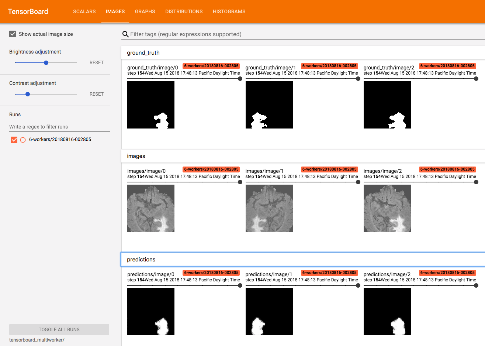

# Distributed U-Net model training using horovod and openmpi on kubernetes

This example explains the process of adapting an MLT horovod template to train
a different model.  In this case, we are using the [distributed U-Net](https://github.com/NervanaSystems/topologies/tree/master/distributed_unet/Horovod),
which locates tumors in brain scan images.

## Prerequisites

This example requires that you have MLT and its depedencies installed.
- [Volume Controller for Kubernetes](https://github.com/kubeflow/experimental-kvc/blob/master/docs/ops.md#installing-the-controller)

You will also need to register to obtain the BraTS dataset.
Information on getting the dataset is located [here](https://github.com/NervanaSystems/topologies/tree/master/distributed_unet#required-data).

## Transferring data to the cluster

* Please refer to this [section](https://github.com/IntelAI/mlt/tree/master/examples/distributed_unet#transferring-data-to-the-cluster)

## Updating the app to run the U-Net model

In order to create the Horovod/U-Net app for MLT, we started by initializing
the app using `horovod` template.  We picked this template since
it was most similar to what we needed to do for running the U-Net model.
These are the steps that we took to update the app

`mlt.json` contains below list of parameters which are required for U-net training.

    "log_dir": "_multiworker",   # For logging
    "num_nodes": "2",            # No.of nodes required for training (Default adds one extra node for master).
    "num_workers_per_node": "1", # No.of workers per node ( Ex: num_nodes: 1 and num_workers_per_node: 4. It will create 4 workers on same node)
    "num_inter_threads": "2",    # No.of inter threads
    "sockets_per_node": "1",     # Assuming all nodes have same spec, do `lscpu` on your node and get value of `Socket(s)`.
                                 # If each node has different spec, specify least sockets(s) value.
    "gpus": "0",                 # If you are node has GPU's , specify value here. By default it will use CPU's

    # Location of your training dataset. In this scenario, we already have RAW data converted to .npy files at this location
    "base_dir": "/var/datasets/unet/vck-resource-8fd827a8-809a-11e8-b982-0a580a480bd4",

    # Location where output results should be stored. In this we are storing at same location as base_dir with output sub_dir.
    "output_path": "/var/datasets/unet/vck-resource-8fd827a8-809a-11e8-b982-0a580a480bd4"


 *NOTE:* If you want add any extra parameters please add them to `template_paramters` section within `mlt.json`. Those paramaters
    are available as environment variables for `deploy.sh`

 1. Replaced the MNIST model training file with the U-Net model training
 python files from the
[NervanaSystems/topologies/horovod](https://github.com/NervanaSystems/topologies/tree/master/distributed_unet/Horovod)
repo. Copied below list of files
    * settings.py - set below variables using parameters from mlt.json(`base_dir` and `output_path`)
        ```bash
        BASE = os.environ.get('BASE_DIR', '/var/datasets/unet/vck-resource-8fd827a8-809a-11e8-b982-0a580a480bd4')
        OUT_PATH = os.environ.get('OUTPUT_PATH', '/var/datasets/unet/vck-resource-8fd827a8-809a-11e8-b982-0a580a480bd4')
        ```
    * preprocess.py - To mask .npy files
    * converter.py - To convert RAW images to .npy files
    * main.py - Main model file
    * data.py - data loader, you can modify it for your data
    * model.py - defining your model
    * exec_multiworker - script to initiate horovod training

 2. This template includes two dockerfiles `dockerfile.cpu` and `dockerfile.gpu`, approprtiate dockerfile will be picked by
    deploy.sh based on `gpus:{value}` from mlt.json. By default it uses `dockerfile.cpu`. For performance efficiency we have used
    intel optimized tensroflow with mkl.

    ```
    # Install MKL optimized tensorflow.
    # If you wish to use general tensorflow. Please comment conda install -c anaconda tensorflow
    # and include tensorflow version in requirements.txt
    RUN conda install -c anaconda tensorflow && \
    conda install pip && \
    conda clean --all
    ```

 3. This template uses custom deployment, where we describe steps in `deploy.sh`.
    We used [kubeflow/openmpi](https://github.com/kubeflow/kubeflow/blob/master/kubeflow/openmpi/README.md) as reference for this deployment.
    This section where we specify `mpirun` command. If you are familiar with `openmpi`, please change configuration as per your
    requirement. Please update `/src/app/exec_multiworker.sh` with your script which initates the training.

    ```
    EXEC="mpirun -np ${WORKERS} \
    --hostfile /kubeflow/openmpi/assets/hostfile \
    --map-by socket -cpus-per-proc $PHYSICAL_CORES \
    --report-bindings \
    --oversubscribe \
    bash /src/app/exec_multiworker.sh \
    ${LOG_DIR} ${PPR} ${NUM_INTER_THREADS}"
    ```
 4. `NODE_SELECTOR` option - There are cases where data scientist wants to target set of nodes to launch job.
     kubeflow openmpi component allows to set that option. We did as below.
     In `deploy.sh` script, look for this section.

     ```
        # Node selector helps to launch job on specific set of nodes with label.
        # For kubernetes nodes we assigned label called `node-type=highmem` to set of nodes.
        # Ex: kubectl label node gke-node-1 node-type=highmem
        NODE_SELECTOR="node-type=highmem"
     ```
     and once you set label above, you should provide that to `ks generate` command as below.
     ```
        ks generate openmpi ${COMPONENT} --image ${IMAGE} --secret ${SECRET} --workers ${WORKERS} --gpu ${GPU} --exec "${EXEC}" --nodeSelector "${NODE_SELECTOR}"
     ```

    When the job completes, the final trained Keras model is saved to the directory you specified in output_path

The updated app is located in the [mlt_app](mlt_app) directory.  Before
running the app, you will need to update:

 * `mlt.json` with:
   * Your `namespace`
   * Your `registry`

## Running the MLT app

Once you've made the necesary updates to the app, you can build and
deploy the app:

```bash
$ mlt build
Starting build unet-horovod:fbf6ab64-e69a-45e4-9f8b-a51f29f1d1c1
Building unet-horovod |############################################################################################################################| (ETA:  00:00:00)
Built unet-horovod:fbf6ab64-e69a-45e4-9f8b-a51f29f1d1c1

$ mlt deploy
Pushing unet-horovod |#############################################################################################################################| (ETA:  00:00:00)
Pushed unet-horovod to gcr.io/constant-cubist-173123/unet-horovod:fbf6ab64-e69a-45e4-9f8b-a51f29f1d1c1
Deploying gcr.io/constant-cubist-173123/unet-horovod:fbf6ab64-e69a-45e4-9f8b-a51f29f1d1c1
level=info msg="Updating configmaps kvadla.unet-horovod-8bfb7b80-8ee7-4710-b16e-7b58c37bb787-assets"
level=info msg=" Creating non-existent configmaps kvadla.unet-horovod-8bfb7b80-8ee7-4710-b16e-7b58c37bb787-assets"
level=info msg="Updating services kvadla.unet-horovod-8bfb7b80-8ee7-4710-b16e-7b58c37bb787"
level=info msg=" Creating non-existent services kvadla.unet-horovod-8bfb7b80-8ee7-4710-b16e-7b58c37bb787"
level=info msg="Updating serviceaccounts kvadla.unet-horovod-8bfb7b80-8ee7-4710-b16e-7b58c37bb787"
level=info msg=" Creating non-existent serviceaccounts kvadla.unet-horovod-8bfb7b80-8ee7-4710-b16e-7b58c37bb787"
level=info msg="Updating clusterrolebindings kvadla.unet-horovod-8bfb7b80-8ee7-4710-b16e-7b58c37bb787"
level=info msg=" Creating non-existent clusterrolebindings kvadla.unet-horovod-8bfb7b80-8ee7-4710-b16e-7b58c37bb787"
level=info msg="Updating pods kvadla.unet-horovod-8bfb7b80-8ee7-4710-b16e-7b58c37bb787-master"
level=info msg=" Creating non-existent pods kvadla.unet-horovod-8bfb7b80-8ee7-4710-b16e-7b58c37bb787-master"
level=info msg="Updating pods kvadla.unet-horovod-8bfb7b80-8ee7-4710-b16e-7b58c37bb787-worker-0"
level=info msg=" Creating non-existent pods kvadla.unet-horovod-8bfb7b80-8ee7-4710-b16e-7b58c37bb787-worker-0"
level=info msg="Updating pods kvadla.unet-horovod-8bfb7b80-8ee7-4710-b16e-7b58c37bb787-worker-1"
level=info msg=" Creating non-existent pods kvadla.unet-horovod-8bfb7b80-8ee7-4710-b16e-7b58c37bb787-worker-1"

Inspect created objects by running:
$ kubectl get --namespace=kvadla all
or
$ mlt status

```

Once the app has been deployed, you should see pods running in
Kubernetes:
```bash
$ mlt status
NAME                                                         READY     STATUS    RESTARTS   AGE       IP             NODE
unet-horovod-8bfb7b80-8ee7-4710-b16e-7b58c37bb787-master     1/1       Running   0          1m        10.x.y.z       gke-node-1
unet-horovod-8bfb7b80-8ee7-4710-b16e-7b58c37bb787-worker-0   2/2       Running   0          1m        10.x1.y1.z1    gke-node-2
unet-horovod-8bfb7b80-8ee7-4710-b16e-7b58c37bb787-worker-1   2/2       Running   0          1m        10.x2.y2.z2    gke-node-3

```

`mlt logs` displays logs

```bash
$ mlt logs
Checking for pod(s) readiness
Will tail 5 logs...
unet-horovod-8bfb7b80-8ee7-4710-b16e-7b58c37bb787-master
unet-horovod-8bfb7b80-8ee7-4710-b16e-7b58c37bb787-worker-0 openmpi-job
unet-horovod-8bfb7b80-8ee7-4710-b16e-7b58c37bb787-worker-0 openmpi-controller
unet-horovod-8bfb7b80-8ee7-4710-b16e-7b58c37bb787-worker-1 openmpi-job
unet-horovod-8bfb7b80-8ee7-4710-b16e-7b58c37bb787-worker-1 openmpi-controller
[unet-horovod-8bfb7b80-8ee7-4710-b16e-7b58c37bb787-worker-0 openmpi-controller] unet-horovod-8bfb7b80-8ee7-4710-b16e-7b58c37bb787-master is in "Running" phase
[unet-horovod-8bfb7b80-8ee7-4710-b16e-7b58c37bb787-worker-0 openmpi-controller] unet-horovod-8bfb7b80-8ee7-4710-b16e-7b58c37bb787-master is in "Running" phase
[unet-horovod-8bfb7b80-8ee7-4710-b16e-7b58c37bb787-worker-0 openmpi-controller] unet-horovod-8bfb7b80-8ee7-4710-b16e-7b58c37bb787-master is in "Running" phase
[unet-horovod-8bfb7b80-8ee7-4710-b16e-7b58c37bb787-worker-0 openmpi-controller] unet-horovod-8bfb7b80-8ee7-4710-b16e-7b58c37bb787-master is in "Running" phase
[unet-horovod-8bfb7b80-8ee7-4710-b16e-7b58c37bb787-worker-0 openmpi-controller] unet-horovod-8bfb7b80-8ee7-4710-b16e-7b58c37bb787-master is in "Running" phase
[unet-horovod-8bfb7b80-8ee7-4710-b16e-7b58c37bb787-worker-0 openmpi-controller] unet-horovod-8bfb7b80-8ee7-4710-b16e-7b58c37bb787-master is in "Running" phase
[unet-horovod-8bfb7b80-8ee7-4710-b16e-7b58c37bb787-worker-0 openmpi-controller] unet-horovod-8bfb7b80-8ee7-4710-b16e-7b58c37bb787-master is in "Running" phase
[unet-horovod-8bfb7b80-8ee7-4710-b16e-7b58c37bb787-worker-0 openmpi-controller] unet-horovod-8bfb7b80-8ee7-4710-b16e-7b58c37bb787-master is in "Running" phase
[unet-horovod-8bfb7b80-8ee7-4710-b16e-7b58c37bb787-worker-0 openmpi-controller] unet-horovod-8bfb7b80-8ee7-4710-b16e-7b58c37bb787-master is in "Running" phase
[unet-horovod-8bfb7b80-8ee7-4710-b16e-7b58c37bb787-worker-0 openmpi-controller] unet-horovod-8bfb7b80-8ee7-4710-b16e-7b58c37bb787-master is in "Running" phase
[unet-horovod-8bfb7b80-8ee7-4710-b16e-7b58c37bb787-worker-0 openmpi-controller] unet-horovod-8bfb7b80-8ee7-4710-b16e-7b58c37bb787-master is in "Running" phase
[unet-horovod-8bfb7b80-8ee7-4710-b16e-7b58c37bb787-worker-0 openmpi-controller] unet-horovod-8bfb7b80-8ee7-4710-b16e-7b58c37bb787-master is in "Running" phase
[unet-horovod-8bfb7b80-8ee7-4710-b16e-7b58c37bb787-worker-0 openmpi-controller] unet-horovod-8bfb7b80-8ee7-4710-b16e-7b58c37bb787-master is in "Running" phase
[unet-horovod-8bfb7b80-8ee7-4710-b16e-7b58c37bb787-worker-0 openmpi-controller] unet-horovod-8bfb7b80-8ee7-4710-b16e-7b58c37bb787-master is in "Running" phase
[unet-horovod-8bfb7b80-8ee7-4710-b16e-7b58c37bb787-worker-0 openmpi-controller] unet-horovod-8bfb7b80-8ee7-4710-b16e-7b58c37bb787-master is in "Running" phase
[unet-horovod-8bfb7b80-8ee7-4710-b16e-7b58c37bb787-master] ----------------------------------------
[unet-horovod-8bfb7b80-8ee7-4710-b16e-7b58c37bb787-worker-0 openmpi-controller] unet-horovod-8bfb7b80-8ee7-4710-b16e-7b58c37bb787-master is in "Running" phase
[unet-horovod-8bfb7b80-8ee7-4710-b16e-7b58c37bb787-master] Loading and preprocessing test data...
[unet-horovod-8bfb7b80-8ee7-4710-b16e-7b58c37bb787-worker-0 openmpi-controller] unet-horovod-8bfb7b80-8ee7-4710-b16e-7b58c37bb787-master is in "Running" phase
[unet-horovod-8bfb7b80-8ee7-4710-b16e-7b58c37bb787-worker-1 openmpi-controller] unet-horovod-8bfb7b80-8ee7-4710-b16e-7b58c37bb787-master is in "Running" phase
[unet-horovod-8bfb7b80-8ee7-4710-b16e-7b58c37bb787-worker-0 openmpi-job] + expr 10 + 1
[unet-horovod-8bfb7b80-8ee7-4710-b16e-7b58c37bb787-master] ----------------------------------------
[unet-horovod-8bfb7b80-8ee7-4710-b16e-7b58c37bb787-worker-0 openmpi-controller] unet-horovod-8bfb7b80-8ee7-4710-b16e-7b58c37bb787-master is in "Running" phase
[unet-horovod-8bfb7b80-8ee7-4710-b16e-7b58c37bb787-worker-1 openmpi-controller] unet-horovod-8bfb7b80-8ee7-4710-b16e-7b58c37bb787-master is in "Running" phase
[unet-horovod-8bfb7b80-8ee7-4710-b16e-7b58c37bb787-worker-0 openmpi-job] + retries=11
[unet-horovod-8bfb7b80-8ee7-4710-b16e-7b58c37bb787-master] ----------------------------------------
[unet-horovod-8bfb7b80-8ee7-4710-b16e-7b58c37bb787-worker-1 openmpi-controller] unet-horovod-8bfb7b80-8ee7-4710-b16e-7b58c37bb787-master is in "Running" phase
[unet-horovod-8bfb7b80-8ee7-4710-b16e-7b58c37bb787-worker-0 openmpi-job] + [ -n  ]
[unet-horovod-8bfb7b80-8ee7-4710-b16e-7b58c37bb787-master] Loading and preprocessing test data...
[unet-horovod-8bfb7b80-8ee7-4710-b16e-7b58c37bb787-worker-1 openmpi-controller] unet-horovod-8bfb7b80-8ee7-4710-b16e-7b58c37bb787-master is in "Running" phase
[unet-horovod-8bfb7b80-8ee7-4710-b16e-7b58c37bb787-worker-0 openmpi-job] + [ -f /kubeflow/openmpi/data/.openmpi-controller/SIGTERM ]
[unet-horovod-8bfb7b80-8ee7-4710-b16e-7b58c37bb787-master] ----------------------------------------
[unet-horovod-8bfb7b80-8ee7-4710-b16e-7b58c37bb787-worker-1 openmpi-controller] unet-horovod-8bfb7b80-8ee7-4710-b16e-7b58c37bb787-master is in "Running" phase
[unet-horovod-8bfb7b80-8ee7-4710-b16e-7b58c37bb787-worker-0 openmpi-job] + sleep 10
[unet-horovod-8bfb7b80-8ee7-4710-b16e-7b58c37bb787-worker-1 openmpi-controller] unet-horovod-8bfb7b80-8ee7-4710-b16e-7b58c37bb787-master is in "Running" phase
[unet-horovod-8bfb7b80-8ee7-4710-b16e-7b58c37bb787-worker-0 openmpi-job] + expr 11 + 1
[unet-horovod-8bfb7b80-8ee7-4710-b16e-7b58c37bb787-worker-1 openmpi-controller] unet-horovod-8bfb7b80-8ee7-4710-b16e-7b58c37bb787-master is in "Running" phase
[unet-horovod-8bfb7b80-8ee7-4710-b16e-7b58c37bb787-worker-0 openmpi-job] + retries=12
[unet-horovod-8bfb7b80-8ee7-4710-b16e-7b58c37bb787-worker-0 openmpi-job] + [ -n  ]
```

Finally once job is completed, you can undeploy which frees up resources
```bash
mlt undeploy
level=info msg="Deleting pods kvadla.unet-horovod-8bfb7b80-8ee7-4710-b16e-7b58c37bb787-worker-1"
level=info msg="Deleting pods kvadla.unet-horovod-8bfb7b80-8ee7-4710-b16e-7b58c37bb787-master"
level=info msg="Deleting pods kvadla.unet-horovod-8bfb7b80-8ee7-4710-b16e-7b58c37bb787-worker-0"
level=info msg="Deleting services kvadla.unet-horovod-8bfb7b80-8ee7-4710-b16e-7b58c37bb787"
level=info msg="Deleting serviceaccounts kvadla.unet-horovod-8bfb7b80-8ee7-4710-b16e-7b58c37bb787"
level=info msg="Deleting clusterrolebindings kvadla.unet-horovod-8bfb7b80-8ee7-4710-b16e-7b58c37bb787"
level=info msg="Deleting configmaps kvadla.unet-horovod-8bfb7b80-8ee7-4710-b16e-7b58c37bb787-assets"
level=info msg="removing environment component" component-name=unet-horovod-8bfb7b80-8ee7-4710-b16e-7b58c37bb787
level=info msg="Removing component parameter references ..."
level=info msg="Deleting component 'unet-horovod-8bfb7b80-8ee7-4710-b16e-7b58c37bb787' at path '/Users/kvadla/git-repo/mlt/examples/horovod_unet/mlt_app/unet-horovod-8bfb7b80-8ee7-4710-b16e-7b58c37bb787/components/unet-horovod-8bfb7b80-8ee7-4710-b16e-7b58c37bb787.jsonnet'"
level=info msg="Successfully deleted component 'unet-horovod-8bfb7b80-8ee7-4710-b16e-7b58c37bb787'"
/Users/kvadla/git-repo/mlt/examples/horovod_unet/mlt_app
```

## Tensorboard results

